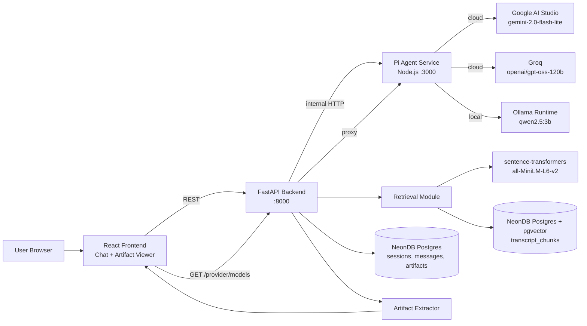

# architecture.md — The Lenny Growth Assistant

## 1. System diagram



## 2. Component boundaries

- **Frontend (React 18 + Vite + TypeScript):** chat UI, session list,
  two-level provider/model selector (live-fetched from `/provider/models`),
  Artifact Viewer (sandboxed iframe for HTML, ReactMarkdown for MD).
  Rate-limit warning banner with auto-dismiss. All sessions, messages, and
  artifacts fetched from FastAPI over REST.
- **API (FastAPI):** `/sessions`, `/messages`, `/artifacts`, `/health`,
  `/provider/models` routes. Pydantic validation. Orchestrates retrieval +
  calls the agent service; contains no LLM-calling logic itself.
- **Agent service (Node.js, internal only):** thin HTTP wrapper around
  `pi-agent-core`. Receives `{messages, context, provider, model_override}`,
  returns `{text, provider_used, model_used, rate_limited, fallback_model,
  artifact}`. Provider selection via `pi-ai`'s unified interface — Gemini,
  Groq, or Ollama. Also exposes `GET /provider/models?provider=X` which
  fetches live model lists from each provider's API.
  **Never exposed to the public internet** — only reachable from the
  FastAPI container on the internal Docker network.
- **Retrieval module (in FastAPI):** chunking/embedding at ingestion time
  (offline script), cosine similarity search at query time via pgvector,
  returns chunks + full source metadata (guest, title, `youtube_url`,
  timestamp) for citation.
- **Artifact extractor (in FastAPI → agent service):** parses
  ` ```html ` / ` ```markdown ` fences from LLM output, persists as
  `ArtifactModel`, returns to frontend for side-pane rendering.
- **Persistence:** NeonDB Postgres — `sessions`, `messages`, `artifacts`,
  `transcript_chunks` (384-dim pgvector column).

## 3. Ingestion / retrieval flow

1. Clone/read `episodes/{guest}/transcript.md` (269 files). Parse YAML
   frontmatter (`guest`, `title`, `youtube_url`, `video_id`,
   `publish_date`, `duration`, `keywords`) and the transcript body.
2. Transcript body has per-speaker-turn timestamps
   (`Speaker Name (HH:MM:SS):`). Chunk by grouping consecutive turns into
   ~500–800 token windows, preserving the **first timestamp in each
   chunk** so a citation can link to `youtube_url&t=<seconds>` — an exact
   moment, not just the episode.
3. Embed each chunk locally via `sentence-transformers/all-MiniLM-L6-v2`,
   store in `transcript_chunks` with `source_title`, `source_url`
   (timestamped), `guest`, `keywords` (reused from frontmatter).
4. Query time: embed the user question with the same model, top-k
   similarity search in pgvector, return chunks + metadata to the agent
   service as context.
5. Agent is instructed (system prompt) to answer only from provided
   context and cite `source_title` + timestamped `source_url` per claim.
   If top-k similarity is below a threshold, respond that the corpus
   doesn't cover the question — never fabricate.
6. Re-ingestion = re-running `python ingest.py` manually. No live
   refresh pipeline.

## 4. Agent routing (Pi-based, multi-provider)

- `pi-ai` natively supports Gemini, Groq, and Ollama — no custom
  provider-adapter code needed, no translation proxy.
- Config value (`LLM_PROVIDER=gemini|groq|ollama`) selects the active
  provider; `LLM_PROVIDER_FALLBACK` is used automatically if the primary
  fails (logged as a structured warning).
- Per-request `model_override` lets the UI send a specific model ID chosen
  by the user — the agent service respects this for the primary provider
  and falls back to provider defaults on rotation.
- Ship 30/30 essay generation is a distinct **skill**: its own system
  prompt (built from the real Ship 30/30 framework) plus output validators
  for word count (~1,250) and heading/hook presence — not folded into the
  general chat prompt.
- Artifact generation: LLM wraps output in ` ```html ` or ` ```markdown `
  fences; the agent service detects this regex and returns the extracted
  content as a typed `artifact` field.

## 5. Model toggle behavior

- Provider selector in UI → triggers `GET /provider/models?provider=X` →
  FastAPI proxies to agent service → agent service queries live provider
  API → returns `{models: [{id, label}]}` → UI populates model dropdown.
- If the primary provider is unreachable/errors → agent service falls
  back per `LLM_PROVIDER_FALLBACK`, logs a structured warning, and the
  API response includes `rate_limited: true`, `fallback_model` — UI shows
  amber banner and updates selected model state.
- UI provider badge reads the *actual* serving provider off each
  response — not the configured default — so a fallback mid-demo is shown
  honestly, not hidden.

## 6. Security (artifact rendering)

- Generated HTML renders inside a **sandboxed iframe**
  (`sandbox="allow-same-origin"` only — no `allow-scripts`), so no
  JavaScript from generated content executes.
- Markdown renders via `react-markdown` with `remarkGfm`. HTML pass-through
  is not enabled, preventing script injection through Markdown.
- Standard API-level validation (Pydantic schemas, parameterized ORM
  queries via SQLAlchemy) covers SQL injection risk for persistence.

## 7. Deployment topology

```
┌─── Docker Compose ──────────────────────────────────────┐
│  api (FastAPI :8000)                                     │
│  agent-service (Node.js :3000) ← internal network only  │
│  frontend (Vite :5173)                                   │
└──────────────────────────────────────────────────────────┘
       ↓ external dependencies (host-level, documented)
  NeonDB (remote managed Postgres + pgvector)
  Ollama (host process, GPU passthrough unreliable in Docker)
```

Docker Compose passes `GEMINI_API_KEY`, `GROQ_API_KEY`, `GROQ_MODEL`,
`GEMINI_MODEL`, `OLLAMA_BASE_URL`, `OLLAMA_MODEL`, `NEON_DATABASE_URL`,
`LLM_PROVIDER`, `LLM_PROVIDER_FALLBACK` from the root `.env` file to
each container via `environment:` blocks.

## 8. Tech Stack Rationale

- **FastAPI / Python:** Standard backend interface choice for microservices. High performance, native typing, and direct integration with Python-native data libraries (`sentence-transformers`, `numpy`).
- **Node.js Agent runtime:** TypeScript wrapper around Pi agent execution core. Since the Pi unified model provider and agent framework only target TS/JS runtimes, this separate helper service is the most logical way to execute the agent.
- **NeonDB Serverless Postgres:** Scalable cloud Postgres with pgvector pre-installed. Eliminates local Postgres configuration overhead, maintains database states cleanly across containers, and provides instant scaling capabilities.
- **sentence-transformers/all-MiniLM-L6-v2:** Produces 384-dimensional vector embeddings locally on CPU. Faster than calling remote embeddings APIs, incurs zero running cost, and has zero external network latency dependency.

## 9. Trade-offs & Limitations

- **Model Capabilities vs. Local Memory:** Running `qwen2.5:3b` locally requires <4GB of memory but yields lower essay generation capabilities compared to cloud APIs (Gemini/Groq). This is documented as a trade-off where cloud represents the quality standard, and local acts as the fallback.
- **Offline / Isolated Ingestion:** Since transcript data is a static 269-episode corpus, we chose offline ingestion via a one-off Python script rather than maintaining a live data-sync connector (cron job/webhook). This saves compute resources and guarantees vector database static sanity.
- **Container Isolation of LLM Runtime:** The Node agent service is fully isolated inside the internal Docker network. The public frontend can only talk to FastAPI, which acts as a secure, authenticated gatekeeper proxy for LLM generation.

## 10. Out of Scope (Current Architecture Boundaries)

- **User Access Delegation & Row Isolation:** Database tables (`sessions`, `messages`, `artifacts`) do not enforce user-level foreign key locks or data partitioning. All endpoints read and write globally based on the UUID requested.
- **DDoS and Request Exhaustion Controls:** There is no API Gateway (like Kong or AWS API Gateway) or rate limiter middleware to throttle client connection frequencies.
- **In-Memory Caching Topology:** The system operates without an intermediate caching layer (e.g., Redis). Every HTTP message triggers fresh database transaction IO and vector compute operations.

## 11. Future Architecture Enhancements

- **Identity Provider (IdP) Gatekeeper:** Integrate a third-party auth middleware (e.g. Clerk SDK) in the FastAPI request pipeline to validate JWTs and restrict SQLAlchemy queries to the authenticated user's scope.
- **Rate-Limiting Middleware:** Install a Redis-backed rate limiter on the FastAPI origin to defend database and external model endpoints from abuse.
- **Vector Semantic Cache:** Introduce an in-memory vector cache layer (e.g., Redis VL) to intercept queries. If a matching query exists within a 0.95 similarity threshold, serve the cached answer immediately to save remote token consumption and CPU cycles.
